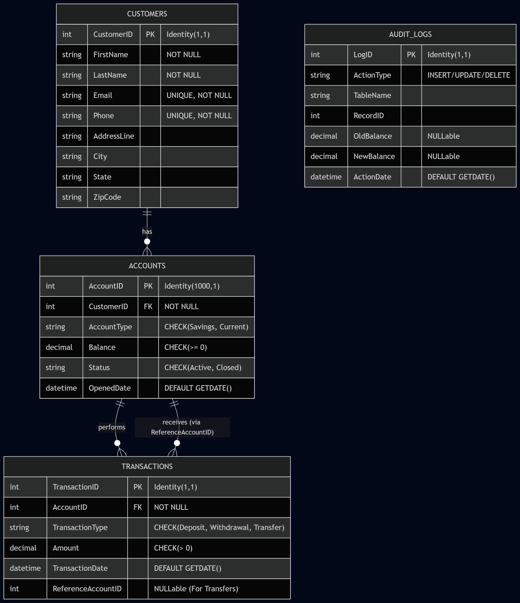

# 🏦 Enterprise Bank Management System

## 📊 Executive Summary
The **Enterprise Bank Management System** is a robust, highly-normalized relational database architecture designed to simulate the core operations of a commercial banking institution. Built using **Microsoft SQL Server (T-SQL)**, this system securely manages customer portfolios, financial accounts (Savings and Current), and multi-directional monetary transactions. The architecture prioritizes data integrity, ACID-compliant fund transfers, and automated audit logging to meet enterprise-level security and reporting standards.

## 🗄️ Database Architecture & Design

The database was meticulously modeled using Entity-Relationship principles and rigorously normalized up to **Third Normal Form (3NF) / Boyce-Codd Normal Form (BCNF)**. This eradicates partial and transitive dependencies, ensuring zero update, insertion, or deletion anomalies.

### Entity-Relationship Diagram (ERD)
The following schema visualizes the core 1-to-Many relationships dictating the flow of data from customers to their accounts and subsequent transactions.



## ⚙️ Core Technical Features

This project emphasizes advanced SQL programmability and security features necessary for a production-grade financial system.

- **Data Integrity & Constraints (DDL):**
  Enforces business rules natively using `PRIMARY KEY`, `FOREIGN KEY` (with cascade deletions), `UNIQUE`, and `CHECK` constraints (e.g., preventing negative balances).
- **Advanced Programmability:**
  - **Triggers:** `AFTER INSERT`, `UPDATE`, and `DELETE` triggers are bound to critical tables, automatically capturing state changes and populating the `AuditLogs` table to maintain a comprehensive security trail.
  - **Functions:** Implements both Scalar and Table-Valued Functions (TVFs) to encapsulate reusable business logic, such as dynamically calculating total customer liquidity.
- **Transaction Control Language (TCL):**
  Guarantees ACID compliance during complex operations. Fund transfers are enclosed in `BEGIN TRAN`, `COMMIT`, and `ROLLBACK` blocks within `TRY...CATCH` structures, preventing partial financial updates.
- **Data Control Language (DCL):**
  Simulates a real-world enterprise environment through role-based access control. Defines `BankTellerRole` and `DBAdminRole` using granular `GRANT`, `DENY`, and `REVOKE` permissions.
- **Complex Analytical Querying:**
  Features a suite of 10+ advanced reports utilizing `INNER`, `LEFT`, `RIGHT`, and `FULL OUTER` joins, correlated subqueries, derived tables, and aggregate functions (`GROUP BY`, `HAVING`). 
- **Performance Optimization:**
  Abstracts complex reporting logic through simple, join-based, and aggregate **Views**, supported by strategic clustered and non-clustered **Indexes** to accelerate query execution.

## 📂 Repository Structure

The project is organized to ensure modularity and ease of execution.

```text
Bank-Management-DBMS-Project/
├── Documentation/
│   └── normalization_report.pdf    # Detailed 1NF to 3NF/BCNF normalization process
├── ERD/
│   └── er_diagram.png              # Rendered Database Schema Diagram
├── Output/
│   └── sample_results.csv          # Exported outputs of complex queries
├── SQL/
│   ├── ddl_scripts.sql             # Table creation and constraint definitions
│   ├── dml_scripts.sql             # Dummy data insertion and sample DML
│   ├── queries.sql                 # Complex analytical queries and reporting
│   ├── views.sql                   # View and Index configurations
│   ├── functions.sql               # Scalar and Table-Valued Functions
│   ├── triggers.sql                # Automated Audit Logging Triggers
│   ├── transaction_control.sql     # ACID-compliant fund transfer simulation
│   └── access_control.sql          # Role-based access DCL commands
└── README.md                       # Enterprise project documentation
```

## 🚀 Execution Guide

To deploy this database locally using SQL Server Management Studio (SSMS) or Azure Data Studio, execute the scripts in the following order:

1. **`SQL/ddl_scripts.sql`**: Initializes the database, tables, and constraints.
2. **`SQL/dml_scripts.sql`**: Populates the tables with foundational dummy data.
3. **`SQL/views.sql`**: Compiles views and performance indexes.
4. **`SQL/functions.sql` & `SQL/triggers.sql`**: Instantiates advanced programmable objects.
5. **Test Scenarios**:
   - Run `SQL/queries.sql` to view analytical reports.
   - Run `SQL/transaction_control.sql` to simulate an atomic fund transfer.
   - Inspect the `AuditLogs` table to view the automated trails generated by the triggers.
